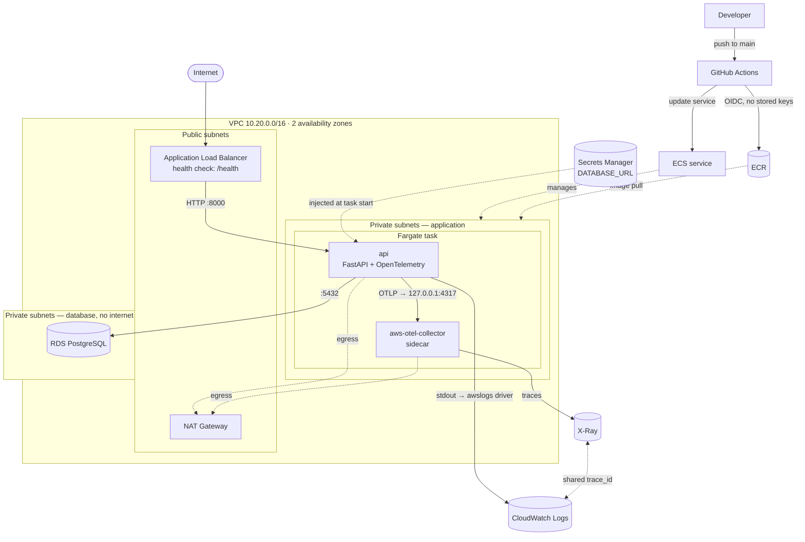

# DevOps Assessment — FastAPI on Fargate

Takes the provided FastAPI service from "runs on a laptop" to a production-shaped
AWS deployment: Terraform-defined infrastructure, a GitHub Actions pipeline that
ships on every push to `main`, and OpenTelemetry instrumentation whose traces land
in X-Ray and whose logs land in CloudWatch — sharing an identifier so either one
leads to the other.

> ### Status: applied to AWS, verified, and torn down
>
> The stack was applied to `us-east-1` and verified end to end on AWS before
> being torn down per the brief's ground rules.
>
> **Verified on AWS:** `terraform apply` created 57 resources; the image was
> built and pushed to ECR; the ECS service came up healthy with two running
> tasks. Over the ALB, `/health` returned `{"status":"ok"}`, `/ready` returned
> `{"status":"ok","database":"ok"}` (real RDS reachability), and the heroes CRUD
> endpoints worked against PostgreSQL. The observability loop was confirmed on
> AWS: traces land in X-Ray, structured JSON logs land in CloudWatch Logs, and
> the two correlate — a log line carrying `trace_id`
> `1-6a8040e4-d11324d75ee369fb6fd2b889` is the same trace visible in the X-Ray
> console. Probe traffic produces zero traces.
>
> **Teardown verified:** `terraform destroy` ran to completion, and the
> post-destroy checks (no NAT gateway, no RDS instance, no ALB) confirmed no
> billable remnant. The stack is a single `terraform apply` away from being
> recreated, documented below.
>
> Everything was also exercised locally under Compose, which caught four real
> defects that no amount of `validate` would have: a Docker image tag that does
> not exist, a PostgreSQL 18 volume layout change, orphan spans escaping the
> health-check exclusion, and a build that depended on a second container
> registry. Those are recorded below rather than quietly fixed, because they are
> the argument for running things.

---

## Contents

- [The application, and what the brief did not mention](#the-application-and-what-the-brief-did-not-mention)
- [Architecture](#architecture)
- [Decisions and trade-offs](#decisions-and-trade-offs)
- [Observability: how traces and logs find each other](#observability-how-traces-and-logs-find-each-other)
- [Running locally](#running-locally)
- [Deploying from a fresh AWS account](#deploying-from-a-fresh-aws-account)
- [Tearing down](#tearing-down)
- [Cost](#cost)
- [What running it caught](#what-running-it-caught)
- [What I would change with more time](#what-i-would-change-with-more-time)
- [How I used AI assistants](#how-i-used-ai-assistants)
- [Repository layout](#repository-layout)

---

## The application, and what the brief did not mention

The brief describes "a small FastAPI project with two endpoints". The repository
actually exposes four, all CRUD over a `heroes` table:

| Method   | Path                | |
|----------|---------------------|---|
| `POST`   | `/heroes/`          | create |
| `GET`    | `/heroes/`          | list, paginated |
| `GET`    | `/heroes/{id}`      | fetch one |
| `DELETE` | `/heroes/{id}`      | delete |

More significantly, **the application requires PostgreSQL and the brief never
says so**. `src/core/config.py` declares `DATABASE_URL` with no default, so the
process refuses to start without it, and `src/main.py` creates the schema during
startup. A deployment that provisions only Fargate produces a task that starts,
fails, is replaced, and fails again.

So RDS is in scope, and with it: where the database lives, how it is reached, and
where its password is kept. Those decisions are covered below.

Two smaller additions were needed before anything could be deployed:

- **`/health` and `/ready`.** The only pre-existing route a load balancer could
  have checked was `GET /heroes/`, which queries the database.
- **A bounded retry around schema creation.** Nothing orders task startup against
  RDS availability.

Both are explained under [Decisions and trade-offs](#decisions-and-trade-offs).

---

## Architecture



Three subnet tiers, each with a different reachability story:

| Tier | Holds | Inbound | Outbound |
|---|---|---|---|
| Public | ALB, NAT gateway | Internet, port 80 | Internet gateway |
| Application | Fargate tasks | ALB security group only | NAT gateway |
| Database | RDS | Application security group only | **No route at all** |

Security group rules reference other security groups rather than CIDR ranges, so
"only the load balancer may reach the application" stays true when subnets are
renumbered or tasks move.

---

## Decisions and trade-offs

### One NAT gateway, not one per availability zone

Fargate tasks in private subnets need outbound access to pull from ECR, read the
database secret, and reach the X-Ray API. A NAT gateway costs roughly
**$0.045/hour**, which in a per-AZ deployment would be the largest line item in a
stack budgeted under two dollars.

**Considered:** one NAT per AZ (correct, three times the cost); interface VPC
endpoints instead of NAT; public subnets with public task IPs and no NAT at all.

**Interface endpoints were the interesting alternative** and I rejected them on
arithmetic. Reaching ECR, CloudWatch Logs, Secrets Manager and X-Ray privately
needs four interface endpoints, billed **per endpoint per AZ** — eight
attachments at ~$0.01/hour is ~$0.08/hour, nearly twice a single NAT gateway.
Endpoints win at steady-state data volumes, where NAT's $0.045/GB dominates; they
lose badly for a stack alive for a few hours.

**Accepted risk:** losing the AZ holding the NAT gateway removes egress for both
private subnets. Tasks already running continue to serve; new tasks cannot start.
For anything long-lived, one NAT per AZ.

### An S3 gateway endpoint, because it is free

ECR stores image layers in S3, so an image pull is mostly an S3 download. A
gateway endpoint keeps that traffic inside the VPC and off the NAT gateway's
per-GB meter. Gateway endpoints cost nothing.

This is the rare change that is simultaneously cheaper and more private, so there
is no trade-off to weigh — but it is worth naming, because "add a NAT gateway"
without it silently routes every deploy's image pull through a metered path.

### The database password is never in the task definition

`random_password` generates it, Terraform writes the assembled connection string
to Secrets Manager, and ECS injects it via `secrets` at task start.

The alternative — a plain `environment` entry — puts the password somewhere
readable by anyone holding `ecs:DescribeTaskDefinition`, and task definitions are
retained as immutable revisions, so it would be effectively published forever.

The password is **alphanumeric only**. It is embedded in a URL, and `@`, `/`, `#`
are URL delimiters; a password containing them parses into the wrong host. Forty
alphanumeric characters is stronger than twenty mixed-symbol ones anyway.

### Two IAM roles per task, not one

| Role | Used by | Grants |
|---|---|---|
| Execution role | ECS agent, before the container starts | ECR pull, log stream creation, **read this one secret** |
| Task role | Application code, at runtime | X-Ray write, log write, ECS Exec channel |

The running container therefore cannot read the secret it was started with, and
cannot pull other images. `xray:PutTraceSegments` is scoped to `*` because the
X-Ray write APIs accept no resource ARN — segments are not addressable objects —
so that is the narrowest grant the API allows, not a shortcut.

### GitHub authenticates by OIDC, and only from `main`

No access keys anywhere. GitHub presents a short-lived token proving which
repository and ref is running; the trust policy pins it to
`repo:<owner>/<repo>:ref:refs/heads/main`, so a pull request from a fork — which
runs under the same OIDC issuer — cannot assume the role.

`iam:PassRole` is restricted to exactly the two task roles this stack owns, with
an `iam:PassedToService` condition. Without that, a deploy role that can register
task definitions can register one that runs as any role in the account.

### The pipeline does not run `terraform apply`

Terraform owns the *shape* of the infrastructure; the pipeline owns *which image
version* runs. A routine code deploy can therefore never replace a database or
tear down a load balancer because somebody edited a variable.

The ECS service declares `ignore_changes = [task_definition, desired_count]` so
that Terraform does not treat the pipeline's deployments as drift and roll them
back on the next apply.

**Trade-off:** infrastructure changes are a deliberate human `apply`, not
continuous delivery. For a two-person change rate that is the safer default; a
larger team would want a `terraform plan` on pull requests and a gated apply.

### Images are tagged with the commit SHA, never `latest`

The tag is the only record of what is running. `latest` makes "roll back to the
previous image" guesswork. A moving `main` tag is published alongside for
convenience, but the SHA tag is what gets deployed.

### `/health` is deliberately dependency-free

The ALB checks `/health`, which touches nothing. `/ready` additionally verifies
the database with `SELECT 1` and returns 503 when it cannot.

Pointing the load balancer at a data-touching route converts a transient database
problem into a task-replacement loop: the ALB marks tasks unhealthy, ECS replaces
them, the replacements meet the same database, and the outage now outlives its
cause. Splitting liveness from readiness is what stops that.

### Schema creation retries, but not forever

`create_db_and_tables` retries with exponential backoff up to ten attempts
(~2 minutes). Nothing orders Fargate task startup against RDS availability, and a
task replacement during an RDS failover will find the endpoint briefly
unreachable.

Bounded on purpose: a wrong password or an unreachable subnet will never resolve
itself, and a task that fails loudly is easier to diagnose than one retrying in
silence.

*(This is a mitigation, not the fix — see
[What I would change with more time](#what-i-would-change-with-more-time).)*

### Deployment circuit breaker with rollback

Without it, a broken image deploys, every task crashloops, and the service sits
failing until a human notices. With it, ECS gives up and restores the previous
task definition. `wait-for-service-stability` in the pipeline means the workflow
reports that failure rather than going green on a successful API call.

### HTTP only, and why there is no TLS

TLS terminates at the ALB in any real deployment, using an ACM certificate for a
domain the account controls, with port 80 redirecting to 443. No domain is
available here, so that listener is not created rather than faked with a
self-signed certificate an ALB would not accept.

**This is the largest gap between this stack and something production-ready**,
and it is a five-line change once a hosted zone exists.

### Local Terraform state

The stack is created and destroyed by one person on one machine within days, and
a remote backend needs its own bootstrapping — bucket, locking, their own
lifecycle — that nothing here justifies. A commented `backend "s3"` block in
`versions.tf` shows the intended shape. The moment a second person or a pipeline
runs `apply`, local state becomes the outage.

### Container image

Multi-stage: a builder installs a pinned `uv` and resolves the locked dependency
set into a virtualenv; a clean `python:3.13-slim` runtime receives only that venv plus
application source. No package manager, no lockfiles, no build tooling ships.

- Dependency manifests are copied **before** source, so an ordinary code change
  reuses the cached dependency layer — pipeline builds stay in the seconds range.
- The container runs as an unprivileged user.
- `PYTHONUNBUFFERED=1`, without which Python buffers log lines and a crash takes
  the most interesting ones with it.
- `--locked` on `uv sync`, so today's build and next month's resolve identically.

---

## Observability: how traces and logs find each other

The correlation requirement is the substance of this assessment, so it is worth
being precise about the mechanism.

### The pipeline

```
FastAPI + SQLAlchemy instrumentation
        │  OTLP/gRPC → 127.0.0.1:4317   (same task, never leaves it)
        ▼
ADOT collector sidecar
        │  awsxray exporter
        ▼
     X-Ray

Application stdout (JSON)
        │  awslogs driver
        ▼
 CloudWatch Logs
```

### Three details that make the link work

**1. Trace ids are X-Ray shaped.** X-Ray rejects ids whose leading 32 bits are
not a plausible epoch timestamp, so the SDK uses `AwsXRayIdGenerator`. Logs
render the same id in X-Ray's `1-<8 hex>-<24 hex>` form, so the string in a log
line is character-identical to the one the console shows — no conversion at 3am.

**2. Propagation uses `X-Amzn-Trace-Id`.** AWS load balancers pass trace context
in that header, not W3C `traceparent`. Without `AwsXRayPropagator`, a request
arriving through the ALB starts a fresh trace instead of continuing the existing
one, and the ALB's own segment never joins up with the application's.

**3. Every log line is JSON carrying `trace_id` and `span_id`.** A custom
formatter reads the active span at log time. Records emitted outside a span omit
the fields entirely rather than logging zeros — absent is clearer than invalid.

```json
{
  "timestamp": "2026-08-11T08:48:24.933460+00:00",
  "level": "INFO",
  "logger": "src.modules.hero.service",
  "message": "hero created",
  "trace_id": "1-6a7ae1d8-e7ef51295a80cb643b555ded",
  "span_id": "6ab8b8743e7e099c",
  "event": "hero.created",
  "hero_id": 7
}
```

### Walking it in both directions

**X-Ray → logs.** Open a trace, copy its id, and run the saved CloudWatch Logs
Insights query `hero-api-assessment/logs-for-a-trace-id` (created by
Terraform) with that id pasted in. It returns exactly the log lines for that one
request.

**Logs → X-Ray.** The saved query `recent-errors-with-trace-ids` lists recent
`ERROR` and `WARNING` lines with their trace ids. Paste one into the X-Ray
console to get the full waterfall for that request.

### Health checks are excluded from tracing — and excluding the route is not enough

Probes fire every fifteen seconds from every ALB node. Tracing them would bury
real traffic and bill X-Ray for the privilege, so both probe routes are listed in
`excluded_urls`.

That alone turned out to be insufficient, which only became visible once the
stack was running. `excluded_urls` suppresses the HTTP **server** span, but the
SQLAlchemy span nested inside `/ready` survives — and a database span with no
parent is promoted to a root trace of its own. Fifteen `/ready` calls produced
thirty one-span traces.

`/ready` therefore wraps its probe query in `suppress_instrumentation()`.
Measured before and after: 50 probe calls, **zero** new traces, while ordinary
traffic is still traced in full. `tests/test_telemetry.py` asserts both halves.

### Logs go via the `awslogs` driver, not through the collector

The collector could carry logs too. It does not, because a collector crash would
then take the logs with it — including the logs explaining the crash. The ECS log
driver is independent of anything running inside the task.

**Trade-off:** two delivery paths to maintain rather than one. Correlation does
not depend on them sharing a pipeline, only on sharing an identifier.

### Verified without AWS

`tests/test_telemetry.py` asserts the correlation directly: that generated ids
are X-Ray shaped, that in-span log records carry the matching `trace_id`, that
out-of-span records omit it, and that neither probe route produces a span. If
someone later swaps the id generator or drops the trace fields, the tests fail
rather than the link silently disappearing in production.

`docker compose up` runs the same ADOT collector binary against Jaeger, so the
waterfall is visible at `http://localhost:16686`. Walking the correlation on the
running stack:

```
log line:   "trace_id": "1-6a7afcbf-73b9fc1358a54622d8df51ee"
Jaeger:      traceID     6a7afcbf73b9fc1358a54622d8df51ee
             spans → POST /heroes/ · connect · INSERT heroes · SELECT heroes
```

Same 128 bits, rendered two ways. On AWS the right-hand side is the X-Ray console
instead of Jaeger; nothing about the application changes.

---

## Running locally

Requires Docker.

```bash
git clone https://github.com/goldkinen/devops-assessment.git
cd devops-assessment
docker compose up --build
```

| | |
|---|---|
| API | http://localhost:8000/docs |
| Traces | http://localhost:16686 (Jaeger) |
| Postgres | `localhost:5433` |

Generate a trace and see it end to end:

```bash
curl -X POST http://localhost:8000/heroes/ \
  -H 'content-type: application/json' \
  -d '{"name":"Deadpond","age":48,"secret_name":"Dive Wilson"}'

docker compose logs api | tail -5     # JSON log lines with trace_id
```

Open Jaeger, pick the `devops-assessment-api` service, and the same trace id is
on the waterfall — the local stand-in for the X-Ray/CloudWatch pairing.

### Tests and checks

```bash
uv sync --all-groups
uv run pytest
uv run ruff check . && uv run ruff format --check . && uv run ty check
terraform -chdir=terraform fmt -check && terraform -chdir=terraform validate
```

---

## Deploying from a fresh AWS account

Prerequisites: AWS credentials with administrative access, Terraform ≥ 1.9, and
the AWS CLI.

**1. Create the registry first, and publish an image into it.**

```bash
cd terraform
terraform init
terraform apply -target=aws_ecr_repository.app
```

Applying the whole stack in one go would create the ECS service pointing at a tag
that does not exist yet, so the first deployment would fail and the circuit
breaker would have nothing to roll back to. Creating the registry first and
pushing an image into it means the service is healthy the moment it exists.

```bash
cd ..
REGISTRY=$(cd terraform && terraform output -raw ecr_repository_url)
TAG=$(git rev-parse --short HEAD)

aws ecr get-login-password --region us-east-1 \
  | docker login --username AWS --password-stdin "${REGISTRY%%/*}"

docker build -t "$REGISTRY:$TAG" .
docker push "$REGISTRY:$TAG"
```

**2. Create everything else.**

```bash
cd terraform
terraform apply -var="image_tag=$TAG"
```

RDS dominates the wait — budget roughly ten to fifteen minutes.

**3. Wire GitHub up to the deployment role.**

```bash
terraform output github_actions_role_arn
```

Set that value as a repository **variable** named `AWS_DEPLOY_ROLE_ARN`
(*Settings → Secrets and variables → Actions → Variables*). It is an ARN, not a
credential, so a variable rather than a secret is appropriate.

> If the account already has a GitHub OIDC provider, run with
> `-var enable_github_oidc=false`. The provider is account-global and a second
> copy fails to create.

**4. Prove the pipeline works end to end.**

```bash
git commit --allow-empty -m "chore: trigger first pipeline deployment"
git push origin main
```

CI runs; on success, Deploy builds the image, pushes it to ECR, registers a task
definition revision pointing at that SHA, updates the service, waits for
stability, and smoke-tests the public endpoint. Steps 1 and 2 proved the
infrastructure; this proves the delivery path.

**5. Confirm.**

```bash
curl "$(terraform output -raw application_url)/health"
curl "$(terraform output -raw application_url)/ready"

curl -X POST "$(terraform output -raw application_url)/heroes/" \
  -H 'content-type: application/json' \
  -d '{"name":"Rusty-Man","age":48,"secret_name":"Tommy Sharp"}'
```

Then open `terraform output xray_console_url` for the trace, and
`terraform output logs_console_url` for the log group with both saved queries
waiting in Logs Insights.

---

## Tearing down

```bash
cd terraform
terraform destroy
```

The stack is built to destroy cleanly and leave no billable remnant:
`force_delete` on the ECR repository, `skip_final_snapshot` and no deletion
protection on RDS, no deletion protection on the ALB, and a zero-day recovery
window on the secret so a re-apply can reuse the same name.

Confirm nothing survives:

```bash
aws ec2 describe-nat-gateways --filter Name=state,Values=available
aws rds describe-db-instances --query 'DBInstances[].DBInstanceIdentifier'
aws elbv2 describe-load-balancers --query 'LoadBalancers[].LoadBalancerName'
```

The NAT gateway and its Elastic IP are the two things that bill silently if a
destroy half-fails, which is why they lead that list.

---

## Cost

Approximate, `us-east-1`, while running:

| | Per hour |
|---|---|
| NAT gateway | $0.045 |
| Application Load Balancer | $0.023 |
| Fargate, 2 × 0.5 vCPU / 1 GB | $0.043 |
| RDS `db.t4g.micro` | $0.016 (Free Tier eligible for 12 months) |
| ECR, Secrets Manager, CloudWatch, X-Ray | Under $0.01 at this volume |
| **Total** | **≈ $0.13/hour** |

Roughly **$0.40 for a three-hour session**, comfortably inside the brief's $2 —
provided the stack is destroyed. Left running it is about $95/month, and the NAT
gateway is a third of that.

Cost decisions taken deliberately: single NAT gateway, single-AZ RDS, Container
Insights disabled, seven-day log retention, ECR lifecycle policy capped at ten
images, health checks excluded from tracing.

---

## What running it caught

Four defects survived linting, type-checking, `terraform validate` and a green
test suite, and died within minutes of `docker compose up`. They are listed
because they are the case for running things rather than reviewing them.

**1. A container image tag that does not exist.** `jaegertracing/all-in-one:1.65`
was plausible and wrong — the project publishes `1.65.0`. Pinned to `1.76.0`.
Nothing that inspects configuration can catch a tag that was never published.

**2. PostgreSQL 18 changed its volume layout.** The image now refuses to start
against a volume mounted at `/var/lib/postgresql/data`, because 18+ stores data
in major-version-specific subdirectories so that `pg_upgrade --link` can work
without crossing a mount boundary. The mount moved up one level to
`/var/lib/postgresql`.

**3. Orphan spans escaping the health-check exclusion.** Covered above: 15
`/ready` calls produced 30 root traces despite the route being excluded, because
route exclusion removes the server span and orphans the database span beneath
it. Fixed with `suppress_instrumentation()`; measured at zero afterwards.

**4. A second registry in the build path.** The builder stage pulled
`ghcr.io/astral-sh/uv`, which became unreachable from inside the Docker VM while
Docker Hub kept working — a one-registry outage was enough to block every build.
The builder now starts from `python:3.13-slim-bookworm` and installs a pinned
`uv` from PyPI. Same result, one fewer thing that has to be up.

---

## What I would change with more time

**Ordered by what I would do first.**

**1. Move schema creation out of application startup.** `Base.metadata.create_all`
on boot means every task races to create the same tables, and there is no
migration history, so no column can ever be changed safely. The fix is Alembic
plus a one-off ECS task run before the service updates — a pipeline step between
push and deploy. The retry currently in `init_db.py` mitigates the startup race
but does not address the missing migration story.

**2. TLS.** ACM certificate, HTTPS listener, port 80 redirecting to 443, and
`drop_invalid_header_fields` already set. Blocked only on a domain.

**3. `terraform plan` on pull requests.** A read-only role, plan posted as a PR
comment, apply still manual. Infrastructure changes currently get less review
than application changes, which is backwards.

**4. Alarms, so failure is noticed without watching.** ALB 5xx rate, ECS running
count below desired, RDS free storage, and — the one people forget — a *deploy
rollback occurred* alarm. Right now the circuit breaker would roll a bad deploy
back correctly and silently.

**5. Interface VPC endpoints, and revisit NAT.** At steady-state data volumes the
arithmetic reverses; endpoints also let task egress be narrowed from `0.0.0.0/0`
to specific AWS services, which is the honest fix for the one over-broad security
group rule in this stack.

**6. Tighten the sampling story.** Everything is traced except health checks,
which is right for an assessment and wrong at volume. X-Ray's centralised
sampling rules are already permitted by the task role.

**7. Autoscaling.** Fixed at two tasks. Target-tracking on CPU or ALB
requests-per-target, with a floor of two.

**8. Remote state and a second environment.** S3 backend with locking; workspaces
or a `dev`/`prod` split, so a change can be tried somewhere that does not matter.

**9. Image supply chain.** Trivy in CI failing on HIGH/CRITICAL, plus signing.
`scan_on_push` is enabled on the repository, but nothing yet gates on the result.

**10. Remove the unused `python-ulid` dependency** and declare `pydantic-settings`
explicitly rather than inheriting it from `fastapi[standard]`. Small, but a
transitive dependency the code imports directly is a dependency waiting to vanish.

---

## How I used AI assistants

The brief asks for this, so here is an honest account rather than a sanitised one.

**Assistant:** Claude (Claude Code in a terminal, with filesystem and shell
access, so it could run what it wrote rather than only produce text).

**How the work was actually structured.** I did not ask for "a Terraform config
for this app". The session ran as an explicit sequence, each step verified before
the next began:

1. Read the repository and report what is there — no changes.
2. Containerise: Dockerfile, `.dockerignore`, Compose, health endpoints.
3. Instrument: OpenTelemetry, X-Ray id generation, JSON logging with trace ids.
4. Terraform, one file at a time: network, ECR, RDS, ALB, IAM, ECS, OIDC.
5. Pipelines: CI, then deploy.
6. This README.

**The most valuable prompt was the first one**, and it was not a request to write
anything:

> Read the repo and tell me what is actually there before changing anything —
> what the app does, what it needs, and what the brief did not mention.

That is what surfaced the database requirement. Asking straight for a Fargate
deployment would have produced a plausible stack that crashloops on first boot,
and the model would not have volunteered the problem.

**Representative prompts:**

> The brief says two endpoints. Check whether that is true, and check whether
> anything else the app needs is missing from the brief.

> For each infrastructure decision, tell me what the alternatives were and what
> the trade-off is — I need to defend these, not just ship them.

> NAT gateway or VPC interface endpoints? Give me the actual arithmetic for a
> stack that lives a few hours, not the general advice.

> The CI job runs the container with no database — but the app creates its schema
> at startup. Does that check actually pass, or have we written a test that
> proves nothing?

> Do not tell me it works unless you have run it. If you cannot run it, say what
> you could not verify.

**Where it was corrected.** The container smoke test in CI was initially written
against a nonexistent database and would have failed — the assistant flagged this
itself when asked to re-examine it, and the job now runs a real Postgres service
container. A verification step also over-reached by asserting on OpenTelemetry
internals rather than behaviour; it was rewritten to capture actual spans through
an in-memory exporter, which is both correct and version-stable.

**Where I did not take its output.** Verification claims. The rule for the session
was that nothing is described as working without a command and its output, and the
status note at the top of this README reflects exactly that standard: the AWS side
was described only after `terraform apply` had run and every claim had output
behind it — and it was torn down once verified.

**My assessment of the approach.** The assistant was strongest at breadth — IAM
trust policy conditions, ECS's two-role split, ADOT wiring — where the failure
mode is not knowing a detail exists. It was weakest exactly where it is most
dangerous: it will describe something as working if not held to evidence.
Structuring the session so that each step ended in a command that either passed
or failed is what made the output trustworthy.

---

## Repository layout

```
.
├── src/
│   ├── core/
│   │   ├── config.py          # settings (unchanged)
│   │   ├── db.py              # SQLAlchemy async engine (unchanged)
│   │   ├── init_db.py         # + bounded retry around schema creation
│   │   ├── logging.py         # NEW: JSON logs carrying X-Ray trace ids
│   │   └── telemetry.py       # NEW: OTel → X-Ray wiring
│   ├── modules/
│   │   ├── health/api.py      # NEW: /health and /ready
│   │   └── hero/              # + structured logging in the service layer
│   └── main.py                # + logging, telemetry, health router
├── tests/                     # NEW: probe contract + correlation assertions
├── terraform/
│   ├── versions.tf            # providers, backend intent
│   ├── variables.tf           # every knob, with validation
│   ├── locals.tf              # naming, AZ selection, CIDR arithmetic
│   ├── network.tf             # VPC, three subnet tiers, NAT, S3 endpoint, SGs
│   ├── ecr.tf                 # repository, scanning, lifecycle policy
│   ├── rds.tf                 # PostgreSQL, generated password, secret
│   ├── alb.tf                 # load balancer, target group, listener
│   ├── iam.tf                 # execution role, task role
│   ├── ecs.tf                 # cluster, task definition (app + ADOT), service
│   ├── github_oidc.tf         # OIDC provider, branch-scoped deploy role
│   └── outputs.tf             # URLs and console links
├── observability/
│   ├── collector-local.yaml   # ADOT → Jaeger, for laptops
│   └── collector-aws.yaml     # ADOT → X-Ray, for Fargate
├── .github/workflows/
│   ├── ci.yml                 # lint, types, tests, terraform, image runs
│   └── deploy.yml             # OIDC → ECR → ECS, waits, smoke-tests
├── Dockerfile                 # multi-stage, non-root
├── docker-compose.yml         # app + Postgres + ADOT + Jaeger
└── README.md
```
